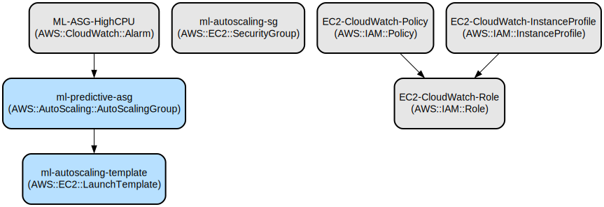

# ML-Based Auto Scaling System for AWS Infrastructure

A machine learning-powered auto scaling solution that predicts and proactively adjusts AWS EC2 instance capacity based on historical usage patterns. This system combines ARIMA and LSTM models to provide accurate scaling predictions while maintaining optimal resource utilization and cost efficiency.

The project implements a complete ML pipeline from data generation to model deployment, with a REST API for predictions and direct integration with AWS Auto Scaling Groups. It features both predictive and reactive scaling capabilities, allowing for A/B testing to validate the effectiveness of ML-based scaling compared to traditional threshold-based approaches.

## Repository Structure
```
ml-autoscaling/
├── api/                      # API implementation for serving predictions
│   └── prediction_api.py     # Flask API with ARIMA and LSTM prediction endpoints
├── aws/                      # AWS infrastructure and integration code
│   ├── autoscaling_integration.py    # Core auto scaling logic
│   ├── create_iam_role.py           # IAM role setup for EC2 instances
│   ├── create_security_group.py     # Security group configuration
│   └── setup_infrastructure.py      # AWS infrastructure provisioning
├── data/
│   └── data_generator.py    # Synthetic training data generation
├── models/                  # ML model implementations
│   ├── arima_model.py      # ARIMA time series model
│   └── lstm_model.py       # LSTM deep learning model
├── tests/
│   └── ab_testing.py       # A/B testing framework for scaling strategies
└── deploy_to_ec2.py        # EC2 deployment automation script
```

## Usage Instructions
### Prerequisites
- Python 3.8 or higher
- AWS account with appropriate permissions
- AWS CLI configured with credentials
- Boto3 (AWS SDK for Python)
- TensorFlow 2.x
- Flask
- Pandas, NumPy, scikit-learn
- statsmodels

### Installation

```bash
# Clone the repository
git clone <repository-url>
cd ml-autoscaling

# Create and activate virtual environment
python -m venv venv
source venv/bin/activate  # Linux/MacOS
venv\Scripts\activate     # Windows

# Install dependencies
pip install -r requirements.txt
```

### Quick Start
1. Generate training data:
```bash
python data/data_generator.py
```

2. Set up AWS infrastructure:
```bash
# Create security group
python aws/create_security_group.py

# Create IAM role
python aws/create_iam_role.py

# Set up infrastructure
python aws/setup_infrastructure.py
```

3. Run the demo:
```bash
python run_demo.py
```

### More Detailed Examples

1. Training models separately:
```python
from models.lstm_model import LSTMPredictor
from models.arima_model import ARIMAPredictor

# Train LSTM model
lstm_model = LSTMPredictor()
lstm_model.train(data, epochs=50)

# Train ARIMA model
arima_model = ARIMAPredictor()
arima_model.train(data)
```

2. Making predictions:
```python
# Get predictions from API
import requests

response = requests.post('http://localhost:5000/predict/combined', 
                        json={'steps': 6})
predictions = response.json()['predictions']
```

### Troubleshooting

1. API Connection Issues
- Error: "Connection refused"
  - Check if API is running: `curl http://localhost:5000/health`
  - Verify security group allows port 5000
  - Check EC2 instance status

2. AWS Infrastructure Issues
- Error: "An error occurred (UnauthorizedOperation)"
  - Verify AWS credentials are configured
  - Check IAM permissions
  - Run `aws configure` to set up credentials

3. Model Training Issues
- Error: "Not enough memory"
  - Reduce batch size in LSTM training
  - Use smaller training dataset
  - Increase EC2 instance size

## Data Flow
The system processes metrics data through ML models to predict future resource requirements and automatically adjust EC2 instance capacity.

```ascii
Metrics Collection → ML Processing → Prediction → Auto Scaling
[CloudWatch] → [ARIMA/LSTM] → [API] → [ASG Update]
```

Component Interactions:
1. CloudWatch collects EC2 metrics every 5 minutes
2. ML models process historical data to generate predictions
3. Prediction API combines model outputs for final scaling decisions
4. Auto Scaling Integration updates ASG capacity based on predictions
5. Security groups control access between components
6. IAM roles manage component permissions

## Infrastructure



AWS Resources:
- EC2:
  - Launch Template: ml-autoscaling-template
  - Security Group: ml-autoscaling-sg
  - IAM Role: EC2-CloudWatch-Role
- Auto Scaling:
  - Auto Scaling Group: ml-predictive-asg
  - Scaling Policies: CPU-based fallback
- CloudWatch:
  - Alarms: ML-ASG-HighCPU
  - Metrics: CPUUtilization

## Deployment

Prerequisites:
- AWS CLI installed and configured
- Security group created
- IAM role configured

Deployment Steps:
1. Create AWS infrastructure:
```bash
python aws/setup_infrastructure.py
```

2. Deploy prediction API:
```bash
python deploy_to_ec2.py
```

3. Start auto scaling integration:
```bash
python aws/autoscaling_integration.py
```

Monitor deployment:
- Check EC2 instance status in AWS Console
- Verify API health: `curl http://<ec2-ip>:5000/health`
- Monitor CloudWatch metrics for scaling activities
